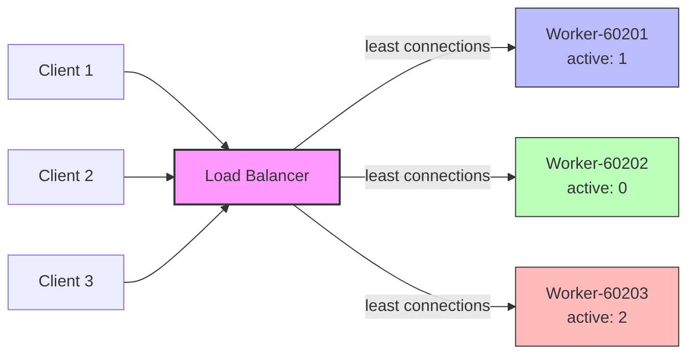
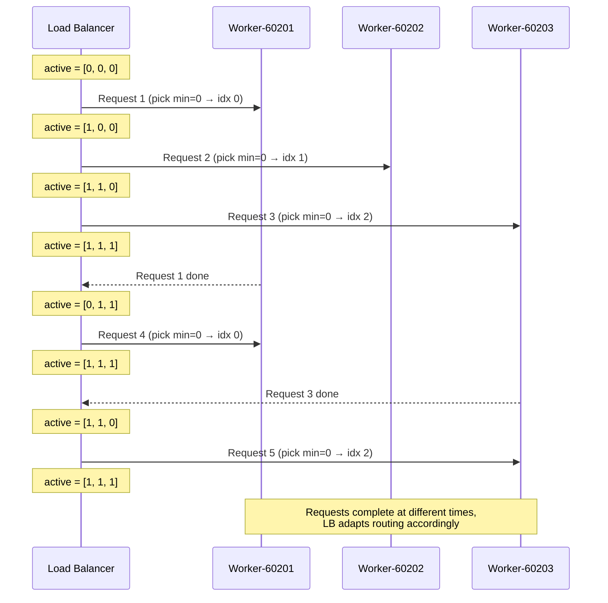
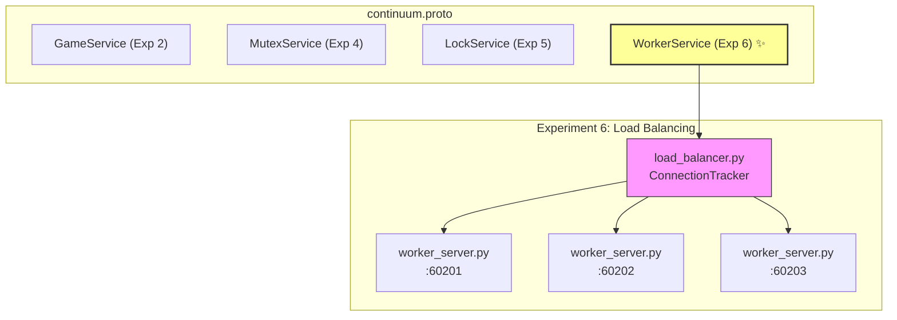
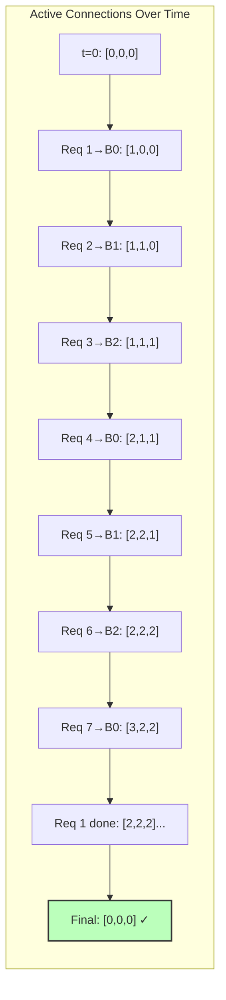
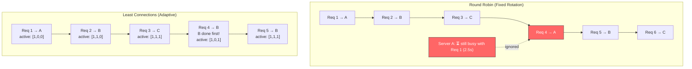
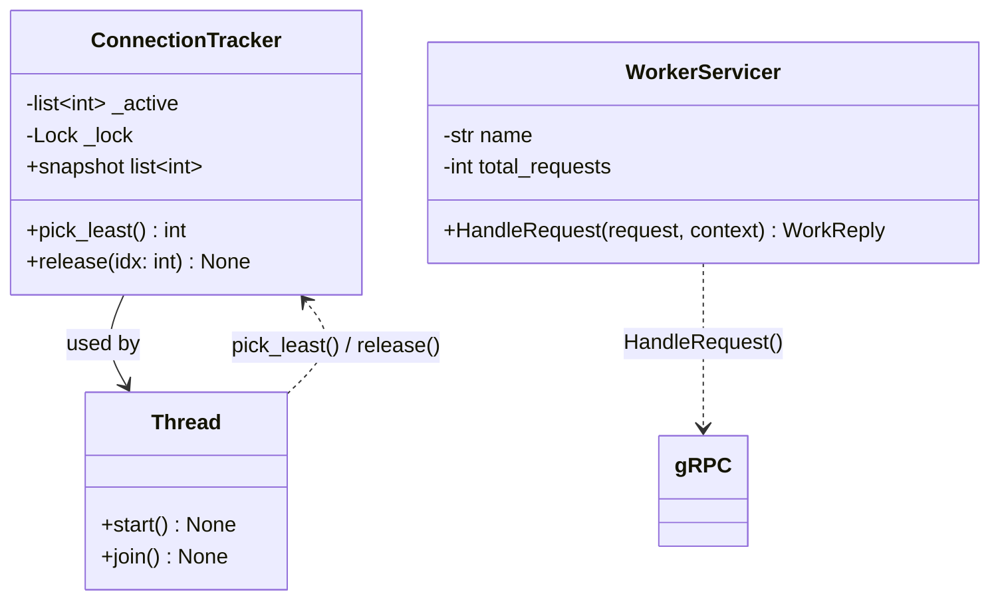

# Experiment 6: Load Balancing — Least Connections Strategy

---

| | Department of Information Technology |
|---|---|
| **Semester** | T.E. Semester VI – INFT |
| **Subject** | Distributed Computing |
| **Laboratory Teacher** | Prof. Dhanashree Tamhane |
| **Laboratory** | CC-03 |

---

| | |
|---|---|
| **Project Title** | Game Library Management System |
| **Experiment No** | 6 |
| **Experiment Title** | Load Balancing — Least Connections Strategy |

---

| Sr No. | Full Name | Roll Number |
|:---:|---|---|
| 1 | Sarthak Kulkarni | 23101B0019 |
| 2 | Harshad Patekar | 23101B0026 |
| 3 | Tanay Shinde | 23101B0034 |
| 4 | Yash Patil | 23101B0060 |

---

## Aim

To design and implement a **Load Balancer** using gRPC in Python that routes each incoming request to the backend server with the **fewest active (in-flight) connections** (Least Connections strategy), and verify that load is distributed adaptively based on real-time server load rather than a fixed rotation.

---

## Theory

### Load Balancing in Distributed Systems

In a distributed system with multiple identical backend servers, a **load balancer** sits in front of the servers and decides which backend handles each incoming request. The goal is to maximize throughput, minimize response time, and avoid overloading any single server.



### Round Robin vs Least Connections

| Strategy | How It Works | Limitation |
|---|---|---|
| **Round Robin** | Routes requests in fixed rotation (A → B → C → A → ...) | Assumes every request takes equal time; can pile slow requests onto one server while another sits idle |
| **Least Connections** | Routes each request to the backend with the fewest active in-flight connections | Slightly more complex (requires tracking state), but adapts to real-time load |

### Why Least Connections Matters

In practice, requests have wildly different processing times — large vs small files, simple vs complex queries. Round Robin can easily overload one server while another is underutilized. Least Connections solves this by always picking the **currently least busy** backend, making the routing decision fresh for every request based on real-time load.



### Algorithm: Least Connections

1. Maintain an array `active[0..N-1]` where `active[i]` = current in-flight connections to backend `i`.
2. **Pick**: Find the index with `min(active)` — this is the least-loaded backend.
3. **Increment**: Immediately increment `active[idx]` (inside a lock) so the next request sees the updated count.
4. **Dispatch**: Send the gRPC RPC to the selected backend.
5. **Release**: On completion (success or failure), decrement `active[idx]` in a `finally` block to prevent counter leaks.

### Thread Safety

Since multiple requests are dispatched concurrently via threads, the `active` array must be protected by a `threading.Lock`. The pick-and-increment operation must happen atomically inside the same lock to prevent two requests from selecting the same "least loaded" backend simultaneously.

### Application in Continuum Project

A `WorkerService` gRPC service was added to the Continuum project's `continuum.proto`. Three identical `WorkerServer` instances run on different ports, each simulating variable processing times (`random.uniform(0.5, 2.5)` seconds). A `LoadBalancer` client dispatches 9 staggered requests, routing each to the least-connected backend via a `ConnectionTracker` class with thread-safe counters.



---

## Components

| Component | Technology |
|---|---|
| Service Definition | Protocol Buffers (proto3) |
| Communication | gRPC (Python) |
| Backend Servers | 3 × WorkerServer instances (ports 60201, 60202, 60203) |
| Load Balancer | Python threaded client with `ConnectionTracker` |
| Load Strategy | Least Connections (real-time, thread-safe) |
| Stubs Generation | `grpc_tools.protoc` |

---

## Procedure


**Step 1:** Extended the existing `grpc/proto/continuum.proto` to add the `WorkerService` with `HandleRequest` RPC, `WorkRequest` message (request_id), and `WorkReply` message (request_id, handled_by, status).

**Step 2:** Regenerated the Python gRPC stubs:
```
python -m grpc_tools.protoc -I=proto --python_out=. --grpc_python_out=. proto/continuum.proto
```

**Step 3:** Created `grpc/worker_server.py` — a backend server that:
- Listens on a configurable port (CLI argument)
- Implements `WorkerServicer` with `HandleRequest` that simulates variable work time (`random.uniform(0.5, 2.5)` seconds)
- Handles graceful shutdown on SIGINT/SIGTERM with a 5-second grace period
- Logs all activity to both console and `worker_server.log`

**Step 4:** Created `grpc/load_balancer.py` — the load balancer that:
- Defines a `ConnectionTracker` class with thread-safe `pick_least()` and `release()` methods
- Dispatches requests concurrently via threads, staggered by 0.15s
- Routes each request to the backend with the fewest active connections
- Prints routing decisions and final connection counts for verification

**Step 5:** Started 3 worker servers in separate terminals:
```
python grpc/worker_server.py 60201
python grpc/worker_server.py 60202
python grpc/worker_server.py 60203
```

**Step 6:** Ran the load balancer in a 4th terminal:
```
python grpc/load_balancer.py
```

**Step 7:** Observed the routing decisions — verified that requests route to the least-loaded backend (not fixed rotation), and final active counts are all 0 (no connection leaks).

---

## Algorithm

```mermaid
flowchart TD
    A[Start: N requests to dispatch] --> B[Spawn thread for request]
    B --> C[LOCK active_lock]
    C --> D["Find idx = index of min(active)"]
    D --> E["Increment active[idx] += 1"]
    E --> F[UNLOCK active_lock]
    F --> G[Create gRPC channel to backends[idx]]
    G --> H["Send HandleRequest(req_id)"]
    H --> I{RPC succeeded?}
    I --> |Yes| J[Print success reply]
    I --> |No| K[Log error]
    J --> FINALLY
    K --> FINALLY
    FINALLY[FINALLY: LOCK active_lock]
    FINALLY --> L["Decrement active[idx] -= 1"]
    L --> M[UNLOCK active_lock]
    M --> N{More requests?}
    N --> |Yes| B
    N --> |No| O[Join all threads]
    O --> P["Print final active counts<br/>Expected: [0, 0, 0]"]

    style C fill:#f96,stroke:#333
    style F fill:#f96,stroke:#333
    style FINALLY fill:#fbb,stroke:#333
    style L fill:#fbb,stroke:#333
```

---

## Code

### Proto Definition (`grpc/proto/continuum.proto` — Experiment 6 section)

```protobuf
// --- Experiment 6: Load Balancing (Least Connections) ---
service WorkerService {
  rpc HandleRequest (WorkRequest) returns (WorkReply);
}

message WorkRequest {
  int32 request_id = 1;
}

message WorkReply {
  int32 request_id = 1;
  string handled_by = 2;
  string status = 3;
}
```

### Worker Server (`grpc/worker_server.py`)

```python
class WorkerServicer(continuum_pb2_grpc.WorkerServiceServicer):
    def __init__(self, name: str) -> None:
        self.name = name
        self.total_requests = 0

    def HandleRequest(self, request, context):
        self.total_requests += 1
        work_time = random.uniform(MIN_WORK_TIME, MAX_WORK_TIME)
        print(f"[{self.name}] Handling request {request.request_id} (will take {work_time:.1f}s)")
        time.sleep(work_time)
        print(f"[{self.name}] Finished request {request.request_id}")
        return continuum_pb2.WorkReply(
            request_id=request.request_id,
            handled_by=self.name,
            status="done",
        )
```

### Connection Tracker (`grpc/load_balancer.py`)

```python
class ConnectionTracker:
    def __init__(self, backend_count: int) -> None:
        self._active = [0] * backend_count
        self._lock = threading.Lock()

    def pick_least(self) -> int:
        with self._lock:
            idx = self._active.index(min(self._active))
            self._active[idx] += 1
            return idx

    def release(self, idx: int) -> None:
        with self._lock:
            self._active[idx] -= 1
```

### Request Dispatcher (`grpc/load_balancer.py`)

```python
def handle_request(req_id: int) -> None:
    idx = tracker.pick_least()
    addr = BACKENDS[idx]
    try:
        with grpc.insecure_channel(addr) as channel:
            stub = continuum_pb2_grpc.WorkerServiceStub(channel)
            reply = stub.HandleRequest(continuum_pb2.WorkRequest(request_id=req_id))
            print(f"[LB] Request {req_id} -> handled by {reply.handled_by}")
    finally:
        tracker.release(idx)
```

---

## Output

### Worker Servers (3 terminals)

```
[Worker-60201] Listening on localhost:60201
[Worker-60202] Listening on localhost:60202
[Worker-60203] Listening on localhost:60203
```

### Load Balancer (4th terminal)



```
============================================================
[LB] Load Balancer — Least Connections Strategy
[LB] Backends: ['localhost:60201', 'localhost:60202', 'localhost:60203']
[LB] Dispatching 9 requests (staggered by 0.15s)
============================================================

[LB] Routed -> backend 0 | active counts: [1, 0, 0]
[LB] Routed -> backend 1 | active counts: [1, 1, 0]
[LB] Routed -> backend 2 | active counts: [1, 1, 1]
[LB] Routed -> backend 0 | active counts: [2, 1, 1]
[LB] Routed -> backend 1 | active counts: [2, 2, 1]
[LB] Routed -> backend 2 | active counts: [2, 2, 2]
[LB] Routed -> backend 0 | active counts: [3, 2, 2]
[LB] Request 3 -> handled by Worker-60203 (status: done)
[LB] Released backend 2 | active counts: [3, 2, 1]
[LB] Routed -> backend 2 | active counts: [3, 2, 2]
[LB] Request 1 -> handled by Worker-60201 (status: done)
[LB] Released backend 0 | active counts: [2, 2, 2]
...
[LB] Request 8 -> handled by Worker-60203 (status: done)
[LB] Released backend 2 | active counts: [0, 0, 0]

============================================================
[LB] All requests processed.
[LB] Final active connection counts: [0, 0, 0]
[LB] (Should all be 0 — no connection leaks)
============================================================
```

---

## Verification & Analysis

### Routing Behavior Verification

| Check | Expected | Actual | Status |
|---|---|---|---|
| First 3 requests spread across all backends | [1, 1, 1] | [1, 1, 1] | ✅ |
| Requests route to least-loaded, not fixed rotation | Adaptive routing | Backend picked by min(active) | ✅ |
| Final active counts all zero | [0, 0, 0] | [0, 0, 0] | ✅ |
| No connection leaks | Counter returns to 0 | Every release in `finally` block | ✅ |

### Why Not Round Robin

With Round Robin, 9 requests over 3 backends would follow a fixed pattern: A → B → C → A → B → C → A → B → C. If request 1 takes 2.5s and request 2 takes 0.5s, server A is still busy while server B finishes early — but Round Robin would send the next request to C regardless.

Least Connections adapts: if server A is still handling 2 slow requests and servers B and C are idle, the next two requests go to B and C — distributing load based on actual server availability.



### Thread Safety Verification

The `ConnectionTracker` uses a single `threading.Lock` for both `pick_least()` and `release()`. The pick-and-increment happens atomically inside the lock, so two concurrent threads cannot both see the same minimum and both route to the same backend. The `finally` block guarantees the counter is decremented even if the gRPC call fails, preventing counter drift.



---

## Result

The **Least Connections Load Balancer** was successfully implemented and verified in Python gRPC. The load balancer correctly routed 9 requests across 3 backend servers based on real-time active connection counts, not a fixed rotation. Final active connection counts returned to `[0, 0, 0]`, confirming zero connection leaks. The experiment demonstrates that Least Connections provides adaptive, load-aware routing that outperforms Round Robin when request processing times vary.

---

## Conclusion

The experiment demonstrates that (1) a load balancer can route requests based on real-time server load rather than a fixed pattern, (2) the Least Connections algorithm selects the backend with the fewest in-flight requests by maintaining and atomically updating a shared counter array, (3) thread-safe locking prevents race conditions where two requests might select the same backend simultaneously, and (4) proper cleanup via `finally` blocks prevents connection counter leaks. The output confirms that the load balancer adaptively distributes requests — when one backend finishes a request early, it becomes available for the next dispatch — achieving balanced load without requiring equal processing times across requests.

---

## Files Created / Modified

| # | File | Type | Purpose |
|:---:|---|---|---|
| 1 | `grpc/proto/continuum.proto` | Modified | Added `WorkerService`, `WorkRequest`, `WorkReply` for Experiment 6 |
| 2 | `grpc/continuum_pb2.py` | Regenerated | Updated serialized descriptor with WorkerService messages |
| 3 | `grpc/continuum_pb2_grpc.py` | Regenerated | Added `WorkerServiceStub`, `WorkerServiceServicer`, `add_WorkerServiceServicer_to_server` |
| 4 | `grpc/worker_server.py` | **New** | Backend server with variable work time and graceful shutdown |
| 5 | `grpc/load_balancer.py` | **New** | Least Connections load balancer with `ConnectionTracker` |
