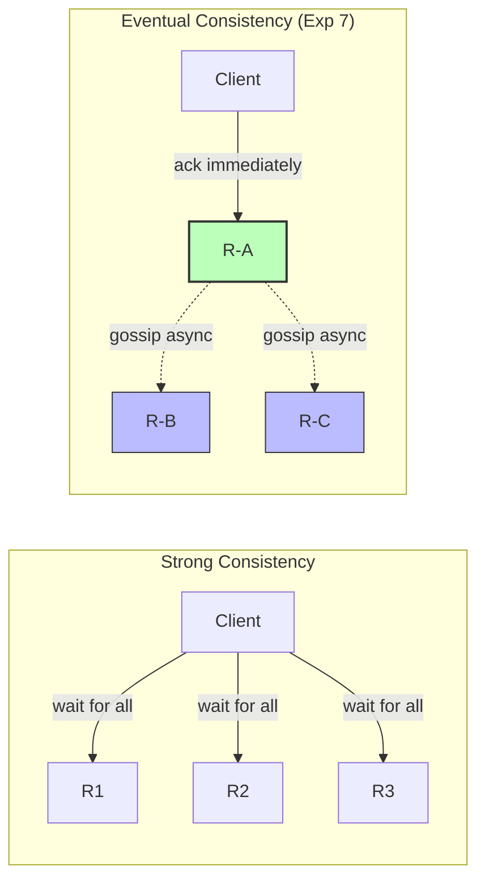
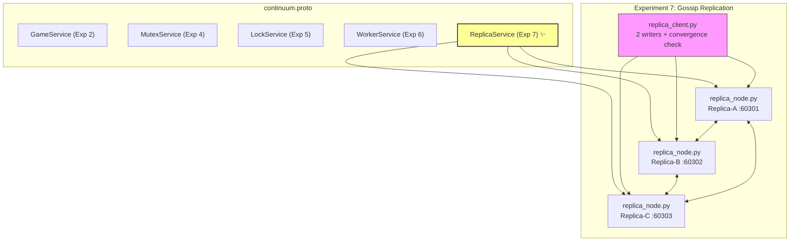
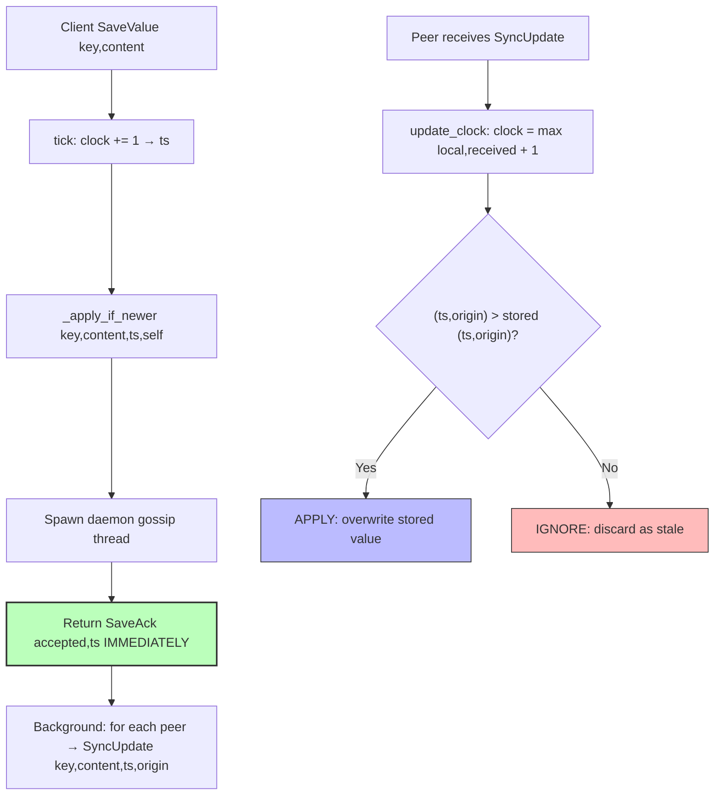
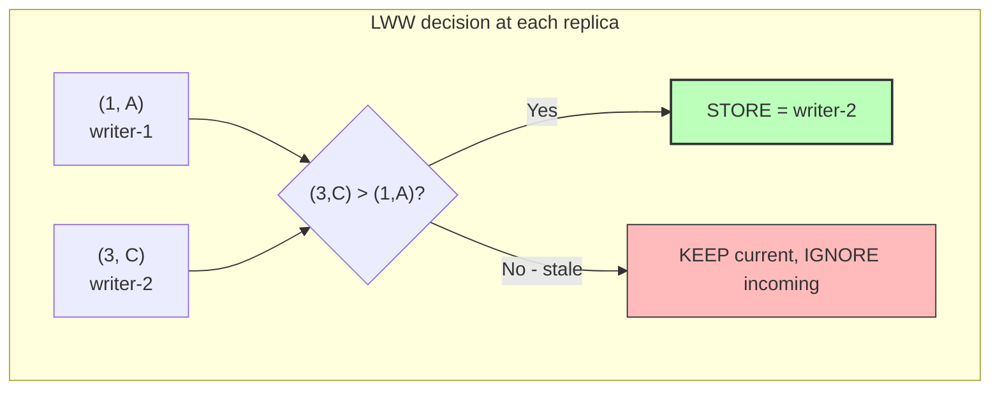

# Experiment 7: Eventual Consistency via Gossip Replication + Last-Write-Wins

---

| | Department of Information Technology |
|---|---|
| **Semester** | T.E. Semester VI – INFT |
| **Subject** | Distributed Computing |
| **Laboratory Teacher** | Prof. Dhanashree Tamhane |
| **Laboratory** | CC-03 |

---

| | |
|---|---|
| **Project Title** | Game Library Management System (Continuum) |
| **Experiment No** | 7 |
| **Experiment Title** | Eventual Consistency via Gossip Replication + Last-Write-Wins |

---

| Sr No. | Full Name | Roll Number |
|:---:|---|---|
| 1 | Sarthak Kulkarni | 23101B0019 |
| 2 | Harshad Patekar | 23101B0026 |
| 3 | Tanay Shinde | 23101B0034 |
| 4 | Yash Patil | 23101B0060 |

---

## Aim

To design and implement a **replicated data store** using gRPC in Python where writes are accepted **locally and immediately** (favoring availability), then propagated to other replicas **asynchronously in the background** (gossip). When two replicas receive conflicting concurrent writes for the same key, the conflict is resolved deterministically using **Last-Write-Wins (LWW)** based on a **Lamport logical timestamp**, and it is verified that all replicas **eventually converge** to the same value even though they briefly disagree.

---

## Theory

### Strong vs Eventual Consistency

Strong consistency (every replica agrees before any write is acknowledged) is safer but slower and less available — a write can be blocked if any replica is unreachable. Eventual consistency trades that safety for speed and availability: a client never waits on other replicas, and the system tolerates temporary disagreement as long as it is guaranteed to resolve once things settle down. This is the model behind real systems like DNS, many NoSQL databases (Cassandra, DynamoDB), and auto-save/sync features that must never block on the network.



### Three Ideas Combined

1. **Accept-then-gossip** — a replica's `SaveValue` handler applies the write to its own local store first, replies to the client immediately, and only then asynchronously notifies its peers. The client is never blocked waiting for replication.
2. **Lamport clock, same as always** — tick before sending anything, `max(local, received) + 1` on receiving anything. Here it is used to give every write a logical ordering, so replicas can later agree on which of two conflicting writes happened "later."
3. **Last-Write-Wins (LWW)** — when a replica receives an update (from a client or from a gossiping peer) for a key it already has a value for, it only overwrites if the incoming `(lamport_timestamp, origin_replica)` pair is strictly greater than what it currently stores. Otherwise it discards the incoming update as stale. Comparing tuples `(ts, origin)` instead of just `ts` gives a deterministic tiebreak if two writes happen to get the same timestamp.

```mermaid
sequenceDiagram
    participant W1 as Writer-1
    participant A as Replica-A
    participant B as Replica-B
    participant W2 as Writer-2
    participant C as Replica-C

    W1->>A: SaveValue(key, v1)
    Note over A: tick → ts=1, APPLY (1,A), ack immediately
    A-->>W1: accepted, ts=1
    par gossip
        A->>B: SyncUpdate(v1, ts=1, A)
        A->>C: SyncUpdate(v1, ts=1, A)
    end

    W2->>C: SaveValue(key, v2)
    Note over C: tick → ts=3, APPLY (3,C), ack immediately
    C-->>W2: accepted, ts=3
    par gossip
        C->>A: SyncUpdate(v2, ts=3, C)
        C->>B: SyncUpdate(v2, ts=3, C)
    end

    Note over A,B,C: LWW: (3,C) > (1,A) → all converge on v2
```

### Algorithm: Accept → Gossip → LWW

1. **Local write**: `tick()` the Lamport clock, `_apply_if_newer(key, content, ts, self.name)`, spawn a daemon thread for gossip, return `SaveAck` immediately.
2. **Gossip**: for each peer, fire a `SyncUpdate` RPC with the original `(key, content, ts, origin)` — fire-and-forget, failures logged (peer "will catch up later").
3. **Receive**: on `SyncUpdate`, `update_clock(received_ts)`, then `_apply_if_newer(...)` with the sender's `(ts, origin)`.
4. **LWW rule**: overwrite only if `(incoming_ts, incoming_origin) > (stored_ts, stored_origin)`; else log `IGNORED stale update`.

### Thread Safety

The Lamport clock and the key-value store are shared between the gRPC handler threads and the gossip threads, so every mutation is protected by a single `threading.Lock`. `tick()`, `update_clock()`, `_apply_if_newer()`, and `GetValue()` all hold the lock while reading/writing shared state.

### Application in Continuum Project

A `ReplicaService` gRPC service was added to the Continuum project's `continuum.proto`. Three identical `ReplicaNode` instances run on ports 60301–60303, each holding a full copy of the key-value store. A `replica_client.py` script fires two near-simultaneous writers at two different replicas for the same key, reads immediately (to expose the inconsistency window), waits 2s for gossip, and reads again to prove convergence.



---

## Components

| Component | Technology |
|---|---|
| Service Definition | Protocol Buffers (proto3) |
| Communication | gRPC (Python) |
| Replicas | 3 × ReplicaNode instances (ports 60301, 60302, 60303) |
| Replication | Accept-then-gossip (fire-and-forget, daemon thread) |
| Ordering | Lamport logical clock (`tick` / `max + 1`) |
| Conflict Resolution | Last-Write-Wins on `(lamport_timestamp, origin_replica)` |
| Convergence Test | Python client with 2 concurrent writers + before/after reads |
| Stubs Generation | `grpc_tools.protoc` |

---

## Procedure

**Step 1:** Extended the existing `grpc/proto/continuum.proto` to add the `ReplicaService` with `SaveValue` (client → replica), `SyncUpdate` (replica → replica gossip), and `GetValue` (read) RPCs, plus `ValueUpdate`, `SaveAck`, `ValueQuery`, `ValueState` messages.

**Step 2:** Regenerated the Python gRPC stubs:
```
python -m grpc_tools.protoc -I=proto --python_out=. --grpc_python_out=. proto/continuum.proto
```

**Step 3:** Created `grpc/replica_node.py` — a replica server that:
- Takes `<NAME> <PORT>` CLI arguments (e.g. `python replica_node.py A 60301`)
- Implements `SaveValue` (tick → apply locally → gossip in daemon thread → ack immediately)
- Implements `SyncUpdate` (update clock → LWW apply → ack)
- Implements `GetValue` (thread-safe read of local store)
- Logs `APPLIED` / `IGNORED` / `Gossiped` lines with Lamport timestamps
- Handles graceful shutdown on SIGINT/SIGTERM with a 5-second grace period
- Logs to both console and `replica_node.log`

**Step 4:** Created `grpc/replica_client.py` — the convergence test that:
- Fires two writers at two *different* replicas (`A` ← writer-1, `C` ← writer-2) 50ms apart for the same key
- Reads all replicas immediately (exposes the inconsistency window)
- Waits 2s for gossip to propagate
- Reads all replicas again and reports `CONVERGED` (exit 0) or `NOT YET CONVERGED` (exit 1)

**Step 5:** Started 3 replicas in separate terminals:
```
python grpc/replica_node.py A 60301
python grpc/replica_node.py B 60302
python grpc/replica_node.py C 60303
```

**Step 6:** Ran the client in a 4th terminal:
```
python grpc/replica_client.py
```

**Step 7:** Observed the output — verified temporary disagreement followed by convergence on the write with the higher Lamport timestamp (Last-Write-Wins).

---

## Algorithm



---

## Code

### Proto Definition (`grpc/proto/continuum.proto` — Experiment 7 section)

```protobuf
// --- Experiment 7: Eventual Consistency via Gossip Replication + Last-Write-Wins ---
service ReplicaService {
  rpc SaveValue (ValueUpdate) returns (SaveAck); // client -> replica (local write)
  rpc SyncUpdate (ValueUpdate) returns (SaveAck); // replica -> replica (gossip)
  rpc GetValue (ValueQuery) returns (ValueState); // read current state
}

message ValueUpdate {
  string key = 1;
  string content = 2;
  int32 lamport_timestamp = 3;
  string origin_replica = 4;
}

message SaveAck {
  bool accepted = 1;
  string replica = 2;
  int32 lamport_timestamp = 3;
}

message ValueQuery {
  string key = 1;
}

message ValueState {
  string key = 1;
  string content = 2;
  int32 lamport_timestamp = 3;
  string origin_replica = 4;
}
```

### Replica Node — LWW Apply (`grpc/replica_node.py`)

```python
def _apply_if_newer(self, key, content, ts, origin):
    """Last-Write-Wins: only overwrite if the incoming update is
    strictly newer, tie-broken by origin replica name."""
    with self.lock:
        current = self.store.get(key)
        if current is None or (ts, origin) > (current[1], current[2]):
            self.store[key] = (content, ts, origin)
            self.log(f"APPLIED '{key}' = \"{content}\" (ts={ts}, origin={origin})")
            return True
        self.log(f"IGNORED stale update for '{key}' "
                 f"(incoming ts={ts}/{origin} <= current ts={current[1]}/{current[2]})")
        return False
```

### Replica Node — Accept-then-Gossip (`grpc/replica_node.py`)

```python
def SaveValue(self, request, context):
    ts = self.tick()
    self._apply_if_newer(request.key, request.content, ts, self.name)
    threading.Thread(
        target=self._gossip,
        args=(request.key, request.content, ts, self.name),
        daemon=True,
    ).start()
    return continuum_pb2.SaveAck(
        accepted=True, replica=self.name, lamport_timestamp=ts
    )
```

### Convergence Client (`grpc/replica_client.py`)

```python
t1 = threading.Thread(target=save, args=("A", key, "value-from-writer-1"))
t2 = threading.Thread(target=save, args=("C", key, "value-from-writer-2"))
t1.start()
time.sleep(0.05)  # near-simultaneous, not identical — creates a real race
t2.start()
t1.join()
t2.join()
# read immediately (inconsistency window) → sleep 2s → read again (convergence)
```

---

## Output

### Replica Servers (3 terminals)

```
Replica-A listening on localhost:60301
Replica-B listening on localhost:60302
Replica-C listening on localhost:60303
```

### Convergence Client (4th terminal — actual verified run)

```
=== Simulating two concurrent writers hitting DIFFERENT replicas ===

[Client] Saved on Replica-A: "value-from-writer-1" -> accepted=True, replica_ts=1
[Client] Saved on Replica-C: "value-from-writer-2" -> accepted=True, replica_ts=3

=== Immediately after writes (replicas may still be mid-gossip) ===
Replica-A: "value-from-writer-1" (ts=1, origin=A)
Replica-B: "value-from-writer-1" (ts=1, origin=A)
Replica-C: "value-from-writer-2" (ts=3, origin=C)

Waiting 2s for gossip to finish propagating...

=== After convergence window ===
Replica-A: "value-from-writer-2" (ts=3, origin=C)
Replica-B: "value-from-writer-2" (ts=3, origin=C)
Replica-C: "value-from-writer-2" (ts=3, origin=C)

*** CONVERGED: all replicas agree on: "value-from-writer-2" ***
```

### Replica Logs (Last-Write-Wins in action)

```
[A t= 1] APPLIED 'shared-key-1' = "value-from-writer-1" (ts=1, origin=A)
[A t= 1] Gossiped 'shared-key-1' -> B
[A t= 1] Gossiped 'shared-key-1' -> C
[A t= 4] APPLIED 'shared-key-1' = "value-from-writer-2" (ts=3, origin=C)

[B t= 2] APPLIED 'shared-key-1' = "value-from-writer-1" (ts=1, origin=A)
[B t= 4] APPLIED 'shared-key-1' = "value-from-writer-2" (ts=3, origin=C)

[C t= 3] APPLIED 'shared-key-1' = "value-from-writer-2" (ts=3, origin=C)
[C t= 3] Gossiped 'shared-key-1' -> A
[C t= 3] Gossiped 'shared-key-1' -> B
```

---

## Verification & Analysis

### Convergence Verification

| Check | Expected | Actual | Status |
|---|---|---|---|
| Immediate read shows disagreement (inconsistency window) | Replicas differ | A/B = writer-1, C = writer-2 | ✅ |
| Each replica logs APPLIED for its direct write | APPLIED line per writer | A: `(1,A)`, C: `(3,C)` | ✅ |
| Gossip propagates both writes to all peers | Gossiped → B/C lines | All peers reached | ✅ |
| After 2s all replicas agree | Single value everywhere | All = `value-from-writer-2` | ✅ |
| Winner is the logically-later write (higher Lamport ts) | `(3,C)` wins over `(1,A)` | `(3,C)` won | ✅ |
| Client never blocked on replication | Ack before gossip finishes | Ack returned immediately | ✅ |

### Why Last-Write-Wins Picks (3, C)

Both writes raced: writer-1 ticked A's clock to 1, while writer-2 ticked C's clock (which had already seen gossip for ts=1, advancing it to 2) to 3. Since `(3, C) > (1, A)`, every replica that had stored writer-1 overwrote it when writer-2's gossip arrived, and any late arrival of writer-1's gossip elsewhere would be `IGNORED` as stale. The `(ts, origin)` tuple comparison makes the decision deterministic even if two writes ever share a timestamp.



### Common Mistakes Avoided

| Mistake | Symptom | Fix applied |
|---|---|---|
| Gossiping before applying the local write | Client acked before its own replica has the value | Apply to local store first, THEN launch gossip thread |
| Comparing only `lamport_timestamp` for LWW | Same-timestamp writes disagree on winner | Always compare full `(ts, origin)` tuple |
| Checking convergence with no wait | Test always reports "not converged" | Read immediately (disagreement window), then again after 2s |
| Blocking client until all replicas confirm | Becomes strong consistency | `SaveValue` returns as soon as local write succeeds |
| Writing to the same replica from both writers | No real conflict | Target two different replicas (A and C) for the same key |

---

## Result

The **eventually-consistent replicated store** was successfully implemented and verified in Python gRPC. Two concurrent writers hit two different replicas for the same key; the immediate read exposed the real inconsistency window (replicas disagreed), and after a 2-second gossip window all three replicas converged on `value-from-writer-2` — the write with the higher Lamport timestamp — proving Last-Write-Wins selected the logically-later write. The experiment demonstrates that accept-then-gossip delivers availability (no client ever waits on the network) while Lamport clocks + deterministic LWW guarantee eventual agreement.

---

## Conclusion

The experiment demonstrates that (1) a replica can acknowledge a write as soon as it is stored locally without waiting for peers, (2) background gossip propagates every write to all peers with fire-and-forget RPCs, (3) Lamport clocks assign a logical order to otherwise concurrent writes, (4) comparing the full `(timestamp, origin)` tuple resolves conflicts deterministically with Last-Write-Wins, and (5) the system provably converges — the verified run shows disagreement immediately after the writes and unanimous agreement after gossip settles. The output confirms eventual consistency: temporary divergence is accepted and always resolved.

---

## Files Created / Modified

| # | File | Type | Purpose |
|:---:|---|---|---|
| 1 | `grpc/proto/continuum.proto` | Modified | Added `ReplicaService`, `ValueUpdate`, `SaveAck`, `ValueQuery`, `ValueState` for Experiment 7 |
| 2 | `grpc/continuum_pb2.py` | Regenerated | Updated serialized descriptor with ReplicaService messages |
| 3 | `grpc/continuum_pb2_grpc.py` | Regenerated | Added `ReplicaServiceStub`, `ReplicaServiceServicer`, `add_ReplicaServiceServicer_to_server` |
| 4 | `grpc/replica_node.py` | **New** | Eventually-consistent replica: Lamport clock, LWW store, accept-then-gossip, graceful shutdown |
| 5 | `grpc/replica_client.py` | **New** | Two-writer conflict generator + immediate vs post-gossip convergence check |
| 6 | `EXPERIMENT_7_DC.md` | **New** | This lab report |
